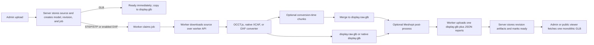

# ModelBase Viewable v1: current-state audit and architecture plan

- Status: architecture proposal only
- Audit baseline: `origin/main` at `aeba844` on 2026-06-30
- Implementation status: not started by this document
- Production status: no deployment or production mutation was performed

## Executive decision

ModelBase Viewable v1 is viable, and a manifest plus independently loadable GLB chunks is the recommended long-term browser delivery path.

The system should continue generating and serving the current `display.glb` as a compatibility artifact while new conversions also produce a revision-scoped, immutable Viewable v1 package. The viewer should prefer the package when it is present and valid, but fall back to the existing GLB route without changing admin, public, QR, original-download, or GLB-download URLs.

The first implementation should not begin with chunking. It should first make the existing Meshopt path an explicitly configured, validated production behavior and expose trustworthy size/compression metrics. The next step should introduce the package and manifest contract with a single geometry chunk. Only then should the converter emit multiple chunks and the viewer progressively schedule them.

The main technical finding is that the repository already has two mechanisms whose names can be misleading in this design:

- Large STEP chunking divides conversion work, merges the results into one GLB, and deletes the transient chunk outputs. It improves conversion reliability/parallelism; it does not stream geometry to browsers.
- Native XCAF mesh reuse already shares safe repeated prototype geometry within a generated GLB. Viewable v1 should preserve and report that behavior, then address cross-chunk duplication separately.

## Scope and safety

This audit is based on repository code and committed documentation. It did not inspect the live EliteDesk `.env`, database, model storage, or running containers, so repository defaults are distinguished from effective production configuration below.

This branch intentionally contains documentation only. It does not:

- change accounts or authentication code;
- change the database schema;
- alter converter, viewer, server, or worker behavior;
- merge or push `main`;
- deploy to the EliteDesk;
- mutate uploads, GLBs, SQLite data, public shares, or QR links.

The branch remains separate because accounts hardening was being handled independently when this work began.

## Current pipeline at a glance



## Repository evidence map

| Concern | Primary implementation |
| --- | --- |
| Storage paths | `apps/server/src/storage.ts` |
| SQLite schema and job transitions | `apps/server/src/db.ts` |
| Upload and model/revision registration | `apps/server/src/routes/models.ts`, `apps/server/src/routes/uploads.ts` |
| Worker API and artifact publication | `apps/server/src/routes/worker.ts`, `apps/server/src/workerPayload.ts` |
| Admin, artifact, download, and public routes | `apps/server/src/server.ts` |
| Worker orchestration | `apps/worker/src/worker.ts`, `apps/worker/src/client.ts` |
| STEP conversion orchestration | `apps/worker/src/converterProcessor.ts` |
| Meshopt post-processing and validation | `apps/worker/src/glbOptimizer.ts`, `apps/worker/src/glbValidation.ts` |
| Large STEP conversion chunk merge | `apps/worker/src/utils/mergeGlbs.ts` |
| JS STEP converter | `apps/converter/src/convertStepToGlb.js` |
| Native XCAF converter | `spikes/occt-xcaf-glb/src/main.cpp` |
| Viewer | `apps/web/src/viewer/ViewerPage.tsx` |
| Admin UI | `apps/web/src/admin/AdminPage.tsx` |
| Container/runtime definition | `Dockerfile.server`, `Dockerfile.worker`, `deploy/docker-compose.elitedesk.yml` |

## Current-state audit

### 1. Upload, admin, and lifecycle flow

#### Upload entry points

The React admin uses two upload paths:

- Files at or below 80 MiB use multipart `POST /api/models`.
- Larger files use `POST /api/uploads/chunked/init`, sequential 50 MiB chunk uploads, and `POST /api/uploads/chunked/:uploadId/complete`.

The server accepts STEP/STP and GLB/GLTF. DXF is accepted only when its feature flag is enabled. STEP/STP and DXF are capped at 500 MiB; GLB/GLTF are capped at 250 MiB. Chunked upload staging lives under `tmp/chunked-uploads` and abandoned directories older than 24 hours are removed at server startup.

The upload flow records the selected quality, per-upload MeshIQ adaptive smoothing option, project/folder assignment where available, revision metadata, and account ownership metadata. New revisions reuse the same basic registration flow. Replacement uploads currently remain multipart-only in the UI and reject files over 80 MiB.

#### Storage and records

On production, `DATA_DIR=/app/data`. The logical storage layout is:

```text
data/
  db/app.sqlite
  uploads/<slug>/...
  models/<slug>/...
  logs/<slug>/...
  worker-output/<slug>/...
```

RevVault adds revision-scoped paths:

```text
data/uploads/<slug>/revisions/<revision-id>/original.<ext>
data/models/<slug>/revisions/<revision-id>/display.glb
data/logs/<slug>/revisions/<revision-id>/conversion.log
```

Replacement file versions can add `versions/<file-version>/` below those revision paths. Legacy non-revision paths remain supported, and startup backfill creates revision rows for legacy models.

#### Status transitions

A direct `.glb` upload is copied to the revision's `display.glb`, receives a minimal `manifest.json`, and is immediately `ready`. STEP/STP and enabled DXF uploads start as `uploaded` with a conversion job.

The worker atomically claims the oldest eligible `uploaded` or `queued` job. Claiming sets the job, revision, and current model to `processing`. Progress updates are stored on the job. Successful artifact publication sets the job/revision/model to `ready`; failures set them to `failed`. Trash and cancellation paths use `cancelling`, `cancelled`, and cancellation timestamps to prevent a late worker result from publishing over a cancelled job.

One adjacent issue is visible but is not changed here: `.gltf` is accepted by upload validation, but the registration code treats only `.glb` as immediately viewable. A `.gltf` upload can therefore become an `uploaded` `viewer-ready` job that the conversion worker does not claim. Viewable v1 should not copy that ambiguity; its accepted source and derived artifact types must be explicit.

#### Admin discovery

The admin calls `GET /api/models`. The server joins project data, latest conversion progress, and a filesystem-derived large-STEP summary from `manifest.json`/`stats.json`. The UI polls every three seconds while any model is active and every fifteen seconds otherwise.

The current large-STEP summary helper reads the legacy model root rather than resolving the active revision artifact directory. It can therefore miss conversion details for newer revision-scoped artifacts. Viewable summaries should be resolved by the selected revision/build row, not inferred from the legacy slug directory.

The current list shows status, quality, GLB size, creation time, revision information, and expandable large-STEP execution details. Those details can show conversion chunk count, timings, raw/final GLB bytes, Meshopt reduction, and resource pressure. They are not a general viewable-package report and do not expose first-load bytes, total package bytes, object coverage, or browser load strategy.

#### Downloads

Authenticated download URLs are stable:

- `/downloads/:slug/original[?revisionId=...]`
- `/downloads/:slug/display.glb[?revisionId=...]`

Original downloads resolve the selected revision's source path. GLB downloads resolve the selected revision's `display_glb_path`. Viewable v1 must not repurpose either route: “Download GLB” should continue to mean the complete legacy/fallback GLB, not an arbitrary first chunk.

#### Admin viewer links

The authenticated viewer remains `/3dviewer/:slug`, with an optional revision query. `GET /api/models/:slug` supplies the selected revision, revisions list, `glb_url`, original download URL, and GLB download URL.

#### Public and QR links

Admin share creation stores a public share row with a hashed token, token prefix, optional recoverable public token, revision linkage, link mode (`locked_revision` or `latest_current`), and optional revision switching.

The public shell URL remains `/public/:token`. The browser fetches `/public/:token/model.json`, then `/public/:token/model.glb`. QR images are generated client-side from that public URL. Ready revision checks and public-selectability rules are enforced server-side. The public GLB response is currently `private, no-store`.

Viewable v1 must extend this response contract; it must not replace the public shell URL or invalidate existing token/revision behavior.

### 2. Converter flow

#### Worker contract

The worker polls the bearer-protected worker API, downloads the source, converts it into a worker-output directory, and uploads artifacts back to `POST /api/worker/jobs/:jobId/complete` as multipart form data.

The server currently requires one `display.glb`. It optionally accepts `manifest.json`, `stats.json`, `material-debug.json`, `xcaf-report.json`, `mesh-report.json`, format/DXF reports, and `conversion.log`. Multer uses memory storage, so the complete artifact upload buffers each accepted file in the server process. That contract is unsuitable for a many-file Viewable package without a new streamed/staged publication mechanism.

#### Backends

The worker supports:

- `occt-js`: `occt-import-js` plus glTF-Transform in `apps/converter`;
- `xcaf-baseline`: the native OpenCascade/XCAF binary built from `spikes/occt-xcaf-glb`;
- `dxf-js`: selected internally for enabled DXF jobs.

The worker image default is `CONVERTER_BACKEND=occt-js`. Committed documentation describes `xcaf-baseline` as the intended/used production direction, but the compose file does not hard-set the backend. Effective live behavior may be overridden by `.env` and was not inspected in this audit. Runtime logs are therefore the authoritative proof for a particular conversion.

#### JS STEP path

The JS converter reads STEP through `occt-import-js`, validates that meshes and hierarchy references are usable, preserves the imported node hierarchy and node names, and builds glTF meshes/materials. It:

- applies global quality-specific OCCT tessellation options;
- preserves explicit face/mesh colours and inherited assembly/name colours;
- supports controlled material-rule fallback/override;
- preserves planar CAD normals and OCCT curved-face normals;
- caches generated glTF meshes by imported mesh index plus inherited material;
- writes `display.raw.glb`, `stats.json`, `material-debug.json`, and `conversion.log`.

It does not emit the native path's stable XCAF selection identifiers or rich object report.

#### Native XCAF path

The native converter uses OpenCascade XCAF for assembly traversal, names, colours, topology, transforms, tessellation, and diagnostics. The Docker build compiles `xcaf-step-to-glb`, `xcaf-step-extractor`, and `xcaf-step-planner` into `/app/bin`.

The native GLB writer currently flattens assembly hierarchy into renderable nodes, but preserves semantic paths and names in node/primitive extras. These include `stableObjectId`, `selectableId`, `labelPath`, `instancePath`, display/part/product/component names, layers, colour sources, and STEP mapping fields. This metadata is what current picking uses.

Mesh reuse is enabled by default unless `DEBUG_DISABLE_MESH_REUSE=true`. Safe repeated prototypes share glTF meshes and accessors while retaining distinct transformed nodes and per-instance selection identity. Mirrored transforms and per-face-styled cases can be excluded from reuse. The native binary can generate `prototype-reuse-report.json` behind an explicit CLI flag, but the worker does not currently request or publish that file. Reuse totals are still copied from `xcaf-report.json` into `stats.json`.

The native converter writes:

- `display.glb`;
- `xcaf-report.json`;
- `mesh-report.json`;
- optional `prototype-reuse-report.json` when explicitly requested;
- `conversion.log` and additional diagnostic profiles.

The worker converts the XCAF report into compatibility `stats.json` and `material-debug.json` files before publication.

#### Large STEP conversion chunking

The compose configuration sets `LARGE_STEP_CHUNKING_MODE=auto`. The worker may pre-scan or plan a large assembly, write label lists, and run several native XCAF processes against subsets. It then:

1. validates every temporary chunk GLB and report;
2. merges the chunk GLBs into `display.raw.glb`;
3. validates node, triangle, material, ID, and bounds preservation;
4. aggregates XCAF/mesh reports;
5. optionally applies Meshopt to the merged file;
6. deletes the temporary chunk directories.

These temporary chunks are conversion implementation details. They are not published, are not stable/cacheable artifacts, and cannot be loaded progressively by the viewer.

#### Current size-reduction behavior

Current reduction mechanisms are:

- upload-selected low/medium/high tessellation presets mapped to native preview/balanced/high settings;
- native safe repeated-prototype mesh reuse;
- DXF-specific geometry cleanup and reuse;
- optional Meshopt post-processing with reordering, conservative quantization, accessor-only pruning/deduplication, semantic validation, and raw fallback;
- optional MeshIQ adaptive tessellation, which remains per-upload default-off and is not a general compression mechanism.

The worker's Meshopt implementation uses pinned library APIs, not a `gltfpack` executable. It uses `@gltf-transform/*` 4.4.0, `meshoptimizer` 1.0.1, and `gltf-validator`. It rejects invalid candidates and publishes the raw GLB if optimization fails or is not smaller.

`GLB_OPTIMIZATION_MODE` defaults to `disabled` in both worker configuration and `Dockerfile.worker`; compose does not explicitly override it. A live `.env` could override the image default, so this audit can conclude that the committed deployment default is off, not that every current production artifact is uncompressed.

Historical committed spike evidence showed an 85,499,096-byte representative GLB reduced to 16,978,808 bytes with the chosen Meshopt settings (80.1%), while preserving 196 node/mesh/primitive records, six materials, selection IDs, and metadata. That is useful evidence, not a universal compression promise.

### 3. Viewer flow

The active React viewer fetches model metadata and then calls one Three.js `GLTFLoader.load()` for `glb_url`. The loader registers Three's bundled `MeshoptDecoder`, so old uncompressed GLBs and `EXT_meshopt_compression` GLBs can use the same path. The legacy server fallback viewer also now registers `MeshoptDecoder`.

No `DRACOLoader` or `KTX2Loader` is configured. There is no texture transcoding path. For the current mostly flat-colour CAD assets, neither is required for Viewable v1.

After the complete GLB is parsed, the viewer:

- wraps it in a centred, Z-up presentation group;
- fixes effectively opaque materials accidentally marked transparent;
- traverses the complete scene to build one selectable mesh array;
- frames the camera from loaded geometry bounds;
- raycasts all selectable meshes on click/tap;
- resolves display names from node/ancestor/geometry/material `userData`;
- applies saved camera/target/root rotation state;
- reports byte progress only for the single GLB request.

There is no separate object-tree UI or metadata service. “Metadata” currently means glTF extras read from the loaded scene, and selection currently displays a resolved name. Materials and hierarchy are embedded in the GLB rather than fetched independently.

The monolithic assumptions that block progressive delivery are:

- metadata exposes only `glb_url`, not a viewable manifest;
- one loader request owns the entire lifecycle;
- camera framing depends on loaded geometry, not manifest bounds;
- one root is installed only after the whole file parses;
- the selectable list is rebuilt from one completed scene;
- there is no object/chunk registry or unloaded-object state;
- revision changes rely on React cleanup, but there is no fetch/parse abort controller;
- errors have one GLB-level fallback path, not chunk retry/fallback semantics.

### 4. Database and filesystem assumptions

#### Existing model and job data

`models` stores identity, source name/extension, overall status, `has_display_glb`, GLB/source bytes, folder, account ownership/visibility, deletion state, saved default view, and current revision.

`jobs` stores model/revision identity, type, status/message, quality, MeshIQ option, timestamps, cancellation/claim/progress state.

`model_revisions` stores revision label/order/date, quality, MeshIQ option, status/current/public-selectable flags, source/display paths and sizes, and conversion job linkage.

`revision_file_versions` stores replacement history and active source/display paths. `public_shares` stores token and revision-selection behavior.

No table or column represents a viewable package, manifest schema version, build ID, chunk count, total package bytes, first-load bytes, or compression coverage.

#### Safe extension point

Viewable packages belong to a revision/file-version conversion result, not to the model name alone. The safest long-term schema is a new `model_viewables` table keyed to `model_revisions`, rather than adding many nullable package fields to `models` or changing `display_glb_path` semantics.

The filesystem package should live beside the revision's current `display.glb`, under an immutable build directory. Existing root/revision files remain untouched.

### 5. Deployment and runtime assumptions

The server image builds the React app, then runs the Node server. The worker image installs build tools and OpenCascade development packages, installs converter and worker dependencies with `npm ci`, compiles the native XCAF converter/planner/extractor, and runs one worker process by default.

The production compose file has two application services, `server` and `worker`. Both see the host `data/worker-output` directory through different container paths, but normal artifact publication still crosses the worker HTTP API. The app data directory is host-mounted into the server.

There is no committed `gltfpack` binary or package installation. Meshopt is already available through worker Node dependencies, and the viewers already have a decoder through their pinned Three.js dependency. Initial Viewable v1 work does not require a new compression dependency.

Adding new native tools would rebuild the worker image, increase build time/image surface, and require deployment validation. Adding only package/publisher code around current libraries still rebuilds both worker TypeScript and, for route/UI changes, the server image. No production rollout should combine this architectural change with unrelated accounts/schema work.

### 6. Current instrumentation and gaps

Current reports can capture:

- source and output GLB bytes;
- conversion time;
- semantic/native quality and tessellation settings;
- triangle, node, mesh, primitive, and material counts (backend-dependent);
- colour/material source diagnostics;
- native part bounds and density/meshing rankings;
- mesh reuse cache counts and unique stored triangles in XCAF stats;
- Meshopt requested/applied/fallback state, raw/final bytes, quantization, and validation;
- conversion-chunk plan, timing, concurrency, memory, swap, and merged validation.

Missing for serious browser optimization:

- total Viewable package bytes versus fallback GLB bytes;
- bytes required for first render;
- per-chunk compressed and decoded bytes;
- per-chunk triangle/object/material counts and bounds;
- deterministic content hashes and cache hit identity;
- exact compression coverage across all chunks;
- cross-chunk repeated-geometry duplication and savings;
- transfer, parse/decode, first-frame, first-pick, and time-to-interactive telemetry;
- peak browser memory and GPU-facing geometry estimates;
- retry/failure/fallback counts by chunk;
- immutable cache behavior and response headers;
- a single report schema shared across STEP, DXF, and future importers.

The future admin UI should show, at minimum:

- source size;
- fallback GLB size;
- total viewable size;
- first-load size;
- chunk count;
- rendered and unique stored triangle counts;
- repeated mesh savings and cross-chunk duplication;
- compression ratio and compressed-chunk coverage;
- conversion backend and version;
- colour mode;
- load strategy;
- schema/build ID and validation status.

## ModelBase Viewable v1 architecture

### Design principles

1. The package is a derived, replaceable browser artifact. The original source and complete `display.glb` remain independent.
2. Every package is immutable and revision/file-version scoped.
3. The manifest is the only entry point; all artifact paths are relative and content/build versioned.
4. Geometry chunks are standard self-contained GLBs. V1 does not invent a custom geometry binary format.
5. Object identity is independent of chunk identity. Chunk boundaries may change across rebuilds without changing semantic object IDs where the source mapping is stable.
6. A package is published atomically only after all files and cross-file invariants validate.
7. The viewer can always abandon the package and load the complete fallback GLB.
8. Importer-specific details stay in reports/metadata; the viewer contract works for STEP, DXF, IFC, Rhino, Revit-derived, and future sources.

### Proposed package layout

For a revision-scoped build:

```text
data/models/<slug>/revisions/<revision-id>/
  display.glb
  manifest.json                       # existing conversion summary, retained
  viewables/
    modelbase-v1/
      <build-id>/
        manifest.json                 # Viewable v1 entry point
        tree.json
        materials.json
        metadata.json
        geometry/
          chunks/
            chunk-000.<hash>.glb
            chunk-001.<hash>.glb
        reports/
          conversion-report.json
          size-report.json
          material-debug.json
          mesh-reuse-report.json
```

`<build-id>` should be immutable and deterministic enough to identify one completed artifact set, for example a truncated SHA-256 of canonical manifest inputs plus converter configuration. Chunk filenames should include content hashes. Sequential prefixes remain useful for humans; hashes make cache correctness explicit.

Legacy models continue using their current root paths. They do not need eager package backfill.

### Manifest schema

V1 should use a named schema and semantic version. Major versions indicate incompatible contracts; minor versions are additive. A viewer must reject an unsupported major version and use `fallback.uri`.

Illustrative schema instance:

```json
{
  "schema": "com.modelbase.viewable",
  "schemaVersion": "1.0.0",
  "buildId": "mbv1-a84c2f94b6d2",
  "generatedAt": "2026-06-30T00:00:00.000Z",
  "model": {
    "slug": "example-model",
    "revisionId": 42,
    "revisionLabel": "B",
    "fileVersion": 1
  },
  "source": {
    "filename": "example.step",
    "format": "step",
    "byteLength": 48123912,
    "sha256": "..."
  },
  "generator": {
    "backend": "xcaf-baseline",
    "version": "...",
    "quality": "medium",
    "colourMode": "xcaf-baseline"
  },
  "coordinateSystem": {
    "sourceUpAxis": "Z",
    "viewerUpAxis": "Y",
    "units": "model-unit",
    "rootTransformPolicy": "viewer-z-up-presentation"
  },
  "bounds": {
    "min": [0, 0, 0],
    "max": [1000, 600, 250],
    "sphere": { "center": [500, 300, 125], "radius": 598.4 }
  },
  "entrypoints": {
    "tree": "tree.json",
    "materials": "materials.json",
    "metadata": "metadata.json"
  },
  "fallback": {
    "kind": "model-metadata-glb-url",
    "byteLength": 31457280,
    "sha256": "...",
    "compression": { "codec": "meshopt", "status": "applied" }
  },
  "loadPlan": {
    "strategy": "priority-chunks",
    "initialChunkIds": ["chunk-000"],
    "initialByteLength": 3145728,
    "maxConcurrentRequestsHint": 3
  },
  "chunks": [
    {
      "id": "chunk-000",
      "uri": "geometry/chunks/chunk-000.7db1c4a9.glb",
      "sha256": "...",
      "byteLength": 3145728,
      "decodedGeometryByteLength": 14260633,
      "triangleCount": 172300,
      "objectCount": 84,
      "bounds": { "min": [0, 0, 0], "max": [1000, 600, 250] },
      "priority": 0,
      "role": "initial",
      "dependencies": [],
      "compression": {
        "codec": "meshopt",
        "extension": "EXT_meshopt_compression",
        "status": "applied",
        "requiresDecoder": true
      }
    }
  ],
  "totals": {
    "packageByteLength": 12582912,
    "geometryByteLength": 11534336,
    "triangleCount": 904120,
    "uniqueStoredTriangleCount": 611400,
    "objectCount": 742,
    "materialCount": 18,
    "chunkCount": 4
  },
  "reports": {
    "conversion": "reports/conversion-report.json",
    "size": "reports/size-report.json",
    "materials": "reports/material-debug.json",
    "meshReuse": "reports/mesh-reuse-report.json"
  },
  "compatibility": {
    "fallbackAvailable": true,
    "allChunksSelfContainedGlb": true,
    "requiresMeshoptDecoder": true,
    "requiresDracoDecoder": false,
    "requiresKtx2Decoder": false,
    "supportsProgressiveSelection": true
  }
}
```

Production schema types must use integers for byte/count fields, finite validated bounds, normalized relative paths, and allowlisted enum values. The final manifest should not contain server hostnames, public tokens, absolute filesystem paths, or secrets.

The fallback URL remains the existing `glb_url` supplied by admin/public model metadata. The static package records fallback identity, size, hash, and compression facts without embedding an auth- or token-specific URL.

#### Companion files

`tree.json` should hold the semantic hierarchy independently of Three.js nodes:

- stable object ID (`selectableId` in current XCAF output);
- parent/child relationships and display order;
- display/part/product/component names;
- chunk membership and primitive IDs;
- object bounds and optional material references;
- flags such as selectable, hidden-by-default, or assembly-only.

`materials.json` should catalog stable material IDs, names, base colours, alpha/double-sided state, source/colour provenance, and which chunks use them. Chunks remain self-contained and still include glTF materials; this catalog supports UI/metadata without loading geometry.

`metadata.json` should hold importer-neutral object properties and importer-specific namespaces. Large free-form metadata should be keyed by object ID rather than duplicated into every chunk. V1 should preserve the current useful glTF extras on render nodes as a picking fallback.

### Database proposal

Add a new table in Phase 2; do not change existing URL or revision columns:

```sql
CREATE TABLE model_viewables (
  id INTEGER PRIMARY KEY AUTOINCREMENT,
  model_id INTEGER NOT NULL,
  revision_id INTEGER NOT NULL,
  schema_name TEXT NOT NULL,
  schema_version TEXT NOT NULL,
  build_id TEXT NOT NULL,
  status TEXT NOT NULL,
  manifest_path TEXT NOT NULL,
  package_size_bytes INTEGER,
  first_load_size_bytes INTEGER,
  chunk_count INTEGER,
  triangle_count INTEGER,
  compression_status TEXT,
  is_current INTEGER NOT NULL DEFAULT 0,
  created_at TEXT NOT NULL DEFAULT CURRENT_TIMESTAMP,
  published_at TEXT,
  FOREIGN KEY (model_id) REFERENCES models(id) ON DELETE CASCADE,
  FOREIGN KEY (revision_id) REFERENCES model_revisions(id) ON DELETE CASCADE,
  UNIQUE (revision_id, schema_name, build_id)
);
```

Add an index for `(revision_id, schema_name, is_current, status)`. Publication should clear the prior row's `is_current` and activate the new ready build in one transaction after filesystem publication succeeds.

Do not create a database row per object or chunk in V1. The manifest is the package inventory; the database stores queryable lifecycle and summary fields. A future object-storage/garbage-collection requirement may justify a separate artifact table.

Existing revisions need no migration beyond table creation. Absence of a ready current `model_viewables` row means “use `display.glb`.”

### Converter and publisher changes

#### Importer-neutral intermediate contract

Create a derived-scene contract between importers and the package builder. Each importer should provide:

- semantic objects with stable IDs, parent IDs, names, properties, bounds, and transforms;
- render primitives with object/primitive IDs, material IDs, geometry, and source/prototype identity;
- material catalog;
- model bounds and coordinate/unit information;
- conversion and diagnostics metadata.

XCAF is the richest initial source and should drive the first implementation, but the package builder must not parse XCAF-only report fields directly in the viewer. DXF and future IFC/Rhino/Revit paths should map into the same contract.

#### Publication protocol

Do not extend the current memory-buffered `/complete` multipart request with dozens of chunk fields. Introduce a staged artifact publication API or equivalent storage abstraction:

1. Worker creates a build/upload session for the claimed job.
2. Worker streams each artifact with declared byte length and SHA-256.
3. Server writes into a job/build staging directory and verifies path, size, and hash.
4. Worker submits the final manifest.
5. Server validates manifest closure: every referenced file exists and every staged file is expected.
6. Server atomically renames the staging directory into the immutable build path.
7. Server commits the ready `model_viewables` row, then completes the conversion job.

The implementation may initially optimize the local shared-volume case, but it should sit behind the same publisher interface so worker and server can later use separate hosts or object storage.

### Chunking strategy

#### V1 unit of identity

Use the current XCAF `selectableId` as the semantic object ID and `stableObjectId` as a primitive/material-bucket ID. All primitives belonging to one selectable object must stay in the same V1 chunk. This avoids partial selection, partial visibility, and metadata ambiguity.

#### Initial grouping algorithm

1. Build the complete object/material/prototype inventory and global bounds before writing chunks.
2. Start with XCAF assembly children or coherent object batches, not arbitrary triangle slices.
3. Keep all instances of the same safely reusable prototype in one chunk when budgets allow.
4. Preserve parent/child adjacency where it does not create an oversized chunk.
5. Bin groups using both estimated encoded bytes and triangle count.
6. Mark a single oversized object as an explicit oversize chunk rather than splitting its selection identity.
7. Emit self-contained GLBs with names, transforms, colours, and picking extras.
8. Validate that every render primitive appears exactly once across the package and every tree object resolves to its declared chunk.

Starting benchmark policy, not a permanent hardcoded rule:

- target 4 MiB compressed and about 250,000 rendered triangles per chunk;
- soft range 2-6 MiB;
- hard target 8 MiB/500,000 triangles, except an indivisible oversized object;
- initial render budget of one or two chunks and no more than about 6 MiB.

These values must be configuration recorded in the report and tuned from real phone measurements. They must not become model-specific conditions.

#### Priority

The first-load set should be deterministic and quality-neutral. Prefer chunks that provide broad model coverage from the saved/default view: large bounding contribution, root assembly envelope, and high projected importance. Remaining chunks can be ordered by hierarchy and spatial proximity. The viewer should receive priorities from the manifest, not reimplement importer heuristics.

“Progressive” must not mean low-quality mobile geometry. Every loaded chunk is final-quality geometry for its objects; the experience improves because useful final geometry arrives earlier.

### Repeated-shape de-duplication

#### Current foundation

Native XCAF already reuses safe prototype geometry inside one GLB and retains distinct transformed nodes. Preserve this path. Promote its metrics from nested XCAF stats and the currently unpublished prototype report into the package size/reuse report.

#### Durable identity

The current process-local topology identity is useful for one conversion run but is not a durable package key. Add a deterministic `prototypeHash` computed from:

- canonical local-space positions, normals, and indices after tessellation policy;
- primitive/material-boundary structure;
- material/style signature where material affects reuse safety;
- quality/adaptive settings and mirrored/winding policy.

Use SHA-256 or another reviewed deterministic content hash. Keep semantic object identity separate from prototype identity: multiple object nodes may reference one prototype mesh while retaining distinct transforms and object IDs.

#### Cross-chunk policy

Standard independent GLBs cannot directly reference a mesh stored in another GLB. V1 should therefore:

- co-locate repeated prototype instances in one chunk where practical;
- reuse one glTF mesh across multiple nodes inside that chunk;
- measure and report any prototype bytes duplicated across chunks;
- accept measured duplication when co-location would destroy first-load or hard-size budgets.

Do not introduce a custom cross-GLB buffer protocol in V1.

`EXT_mesh_gpu_instancing` is a later draw-call optimization, not the prerequisite for transfer de-duplication. Before enabling it, prove per-instance selection, object metadata, visibility/isolation, mirrored transforms, and material variation. A future implementation will likely need per-instance object-index attributes mapped through `tree.json`.

The reuse report should include total instances, unique prototypes, reused instances, raw duplicated bytes avoided, cross-chunk duplicate bytes, rendered triangles, unique stored triangles, unsafe-reuse reasons, and top savings groups.

### Meshopt strategy

The exact production implementation should continue using the existing worker library path, not add `gltfpack` merely for naming consistency:

```text
raw GLB
  -> reorder for size
  -> conservative quantization
  -> accessor-only prune/dedup
  -> EXT_meshopt_compression required
  -> glTF Validator plus semantic snapshot comparison
  -> publish candidate if valid and smaller; otherwise raw fallback
```

Phase 1 should:

1. confirm both actually served viewer builds register `MeshoptDecoder` (the repository currently does);
2. make `GLB_OPTIMIZATION_MODE=meshopt` explicit in the deployment configuration after fixture/canary validation instead of relying on a hidden `.env` override;
3. retain raw fallback behavior;
4. record `extensionsRequired`, candidate/final bytes, hash, validator counts, semantic gates, and fallback reason;
5. expose those facts in the admin UI.

Each V1 chunk must be optimized and validated independently. Package validation must also ensure every chunk's declared compression status matches its glTF JSON. “Compressed” is true only when:

- `EXT_meshopt_compression` is present where expected in buffer views;
- the extension is declared required for compressed-only data;
- the decoder can read the file;
- glTF Validator has no errors;
- semantic IDs, hierarchy references, materials, triangle counts, and bounds pass comparison.

If one chunk fails optimization, V1 may publish that chunk raw while other chunks remain compressed, provided the manifest accurately reports mixed coverage and all chunks validate. A failure to build or validate required geometry must fail the package build and leave `display.glb` as the viewer fallback.

### Progressive viewer strategy

#### API selection

Extend admin and public model metadata with optional fields:

```json
{
  "viewable_manifest_url": ".../manifest.json",
  "viewable_schema_version": "1.0.0",
  "glb_url": "existing fallback URL"
}
```

The existing `glb_url` remains mandatory for ready models during the dual-output rollout.

#### Load sequence

1. Fetch model metadata as today.
2. If no Viewable URL exists, load `glb_url` unchanged.
3. Fetch and validate the manifest; on unsupported/invalid manifest, load `glb_url`.
4. Fetch `tree.json`, `materials.json`, and initial chunks in parallel within a small request budget.
5. Frame the camera using full manifest bounds so the model does not jump as chunks arrive.
6. Add each parsed chunk below one stable presentation root and register object/primitive IDs.
7. Render after the initial set; continue prioritized loading in the background.
8. Keep selection, revision, saved-view, theme, and download controls usable throughout.

Use `fetch(..., { signal })` plus `GLTFLoader.parseAsync(arrayBuffer, baseUrl)` rather than only `GLTFLoader.load()`. This enables cancellation on revision/navigation changes and permits byte-accurate queue progress. Start conservatively with two concurrent geometry requests on narrow/mobile environments and three or four on desktop, then tune from evidence.

#### Selection and object tree

Maintain registries such as:

- `objectId -> tree record`;
- `objectId -> loaded Three.js objects`;
- `chunkId -> state, bytes, scene, abort controller`.

Click selection resolves the current mesh's object ID and can highlight every loaded material bucket for that object. An object-tree selection for unloaded geometry may prioritize its chunk and show a loading state. Visibility/isolation state belongs to object IDs and must be re-applied as later chunks arrive.

#### Loading UX

Show separate states rather than one ambiguous percentage:

- preparing model metadata;
- loading first view (bytes/chunks);
- interactive, with remaining parts loading;
- retrying a chunk;
- package unavailable, loading complete fallback.

Do not silently download most of a failed package and then a 50 MiB fallback. Retry transient chunk failures, and make fallback transition explicit after clearing/disposal.

### Routes and caching

Add revision-aware artifact routes without changing existing routes. Conceptually:

- admin: `/model-files/:slug/viewables/:buildId/...`;
- public: `/public/:token/viewables/:buildId/...`.

The implementation must resolve the model/revision/share before filesystem access, normalize paths, and serve only files listed by the ready manifest. Never expose a raw directory traversal or wildcard filesystem fallback.

Caching policy:

- model metadata and “current viewable” resolution: `no-store` or short/private revalidation;
- immutable build manifests and hashed artifacts: `private, max-age=31536000, immutable`;
- public token-scoped artifacts: also `private` to avoid shared-cache token leakage;
- support `HEAD`, validators, and byte ranges where the HTTP stack does so safely;
- never set immutable caching on mutable legacy `display.glb` URLs.

The public QR route stays `/public/:token`; only its internal metadata response gains an optional manifest URL.

### Admin/reporting changes

Add a general Viewable section separate from conversion-chunk execution details. It should display:

- build/schema status and fallback availability;
- source, fallback, total package, and first-load sizes;
- chunk count and compressed coverage;
- rendered versus unique stored triangles;
- reuse savings and cross-chunk duplication;
- backend, colour mode, quality, and load strategy;
- per-chunk bytes, triangles, objects, priority, bounds, compression, validation;
- package validation/fallback reasons.

Avoid reading many JSON files synchronously for every model-list request. Persist list-level summary columns in `model_viewables`; load detailed manifest/report data only for a model details endpoint.

## Backward compatibility and migration

1. Existing records and files remain unchanged. No eager data migration is required.
2. Existing viewer/public/download URLs continue to resolve `display.glb` exactly as they do today.
3. New conversions initially generate both the complete GLB and a Viewable package.
4. The viewer uses Viewable v1 only when the selected revision has a ready, supported build.
5. Invalid/missing package metadata falls back to `glb_url`.
6. Original and GLB downloads never depend on package health.
7. Locked-revision and latest-current public shares resolve a viewable from the same active revision they already resolve for GLB.
8. Replacing/reconverting a revision publishes a new immutable build and flips the current viewable pointer only after validation. Old build deletion is a separate retention/garbage-collection operation.
9. Old QR codes remain valid because neither the share token nor public shell route changes.

Do not rename `manifest.json` in existing artifact directories or reinterpret it as Viewable v1. The Viewable manifest has its own namespaced build path and schema marker.

## Test strategy and release gates

### Unit tests

- Manifest parser/schema version, finite bounds, enums, relative paths, hashes, and closure.
- Deterministic build/prototype/chunk hashing.
- Chunk budget behavior, oversize-object handling, and deterministic ordering.
- Every selectable object kept within one chunk.
- Object/primitive coverage exactly once and tree parent validity.
- Prototype grouping, transform preservation, unsafe reuse, and savings accounting.
- Mixed compressed/raw chunk reporting.
- DB lifecycle: staging, ready/current switch, failed build, revision deletion.
- Route path normalization and manifest allowlisting.

### Converter/package fixtures

Use only safe synthetic or approved copied fixtures:

- simple coloured part;
- nested assembly with meaningful names;
- repeated prototype assembly;
- mirrored repeated parts;
- per-face colours/material buckets;
- large sparse and tiny dense parts;
- current large representative STEP assembly;
- enabled DXF fixture when testing importer neutrality.

For every build, compare fallback versus package totals for object IDs, primitive IDs, names, transforms, materials/colours, bounds, and rendered triangles. Validate every GLB with glTF Validator and load it through the same Three.js decoder used by the app.

### Server/worker integration

- Upload -> job claim -> staged artifacts -> atomic publish -> ready status.
- Cancellation and superseded revision cannot publish a viewable.
- Failed finalize leaves no ready DB pointer and does not damage `display.glb`.
- Admin access, account workspace access, original download, and GLB download.
- Revision selection and replacement produce the correct immutable build.
- Legacy model without a package still loads.

### Viewer/browser tests

- Manifest-first success and invalid-schema fallback.
- Initial chunk produces a correctly framed, final-quality first view.
- Later chunks do not move the camera/root or lose prior selection.
- Selection name, highlight, visibility, and object-tree behavior across chunks.
- Revision switch aborts requests and disposes prior geometry/materials.
- Meshopt and raw chunks, mixed package, transient retry, permanent fallback.
- Saved view, Z-up presentation, themes, rotate controls, and mobile gestures.
- No console errors, leaked requests, or retained GPU resources after navigation.

### Public/QR regression

- Existing public token URL and QR open successfully.
- Locked and latest-current shares choose the same revision as before.
- Public revision switching honors public-selectable flags.
- Public manifest/chunks cannot escape the resolved model/revision/build.
- Revoked/deleted shares return the existing unavailable behavior.
- Original and GLB download permissions remain unchanged.

### Performance evidence

Record on representative desktop, iPhone, and Android devices:

- metadata/manifest/tree bytes and latency;
- first chunk response end, decode end, first frame, and first successful pick;
- total load time and transferred bytes;
- peak JS heap where measurable and GPU estimate;
- orbit frame rate and thermal behavior;
- cache-cold versus cache-warm behavior;
- fallback rate and chunk retry count.

Do not declare success from smaller files alone. A package must improve time to useful first frame without regressing identity, colours, final geometry quality, or interaction stability.

## Recommended phases

### Phase 0: audit and contract

- This audit and architecture document.
- Confirm effective Meshopt/backend configuration from deployment evidence during the later implementation/rollout task.
- Define typed manifest/tree/material/metadata/report schemas and fixture baselines.

### Phase 1: production Meshopt and trustworthy metrics

- Keep the current monolithic delivery model.
- Make Meshopt mode explicit, validate it on fixture/canary conversions, and retain raw fallback.
- Surface source/raw/final bytes, triangle counts, backend, colour mode, reuse counts, compression state, and semantic validation.
- Add content/hash inspection proving that delivered GLBs are actually compressed.
- Do not enable MeshIQ adaptive tessellation or simplification as part of this phase.

### Phase 2: Viewable v1 package with one geometry chunk

- Add schema/types, `model_viewables`, immutable storage, staged publication, routes, and metadata fields.
- Generate tree/material/metadata/report files plus one chunk representing the complete model.
- Viewer uses manifest-first loading and falls back to `display.glb`.
- This proves lifecycle, auth, revisions, public links, caching, and rollback before multi-chunk complexity.

### Phase 3: hierarchy-aware chunk generation and progressive viewer

- Add budgeted XCAF object/assembly batching.
- Generate multiple independently validated GLBs with full bounds and priorities.
- Add viewer queue, cancellation, incremental scene/selection registry, loading UX, and per-chunk reports.
- Keep the complete `display.glb` fallback.

### Phase 4: repeated-shape optimization and reporting

- Preserve current native mesh reuse and add durable prototype hashes.
- Co-locate instances where beneficial; quantify cross-chunk duplication.
- Expose actual byte/triangle savings in reports/admin.
- Experiment with `EXT_mesh_gpu_instancing` only behind selection/metadata gates.

### Phase 5: smarter loading and CAD presentation

- Tune priority from saved/default view and measured device behavior.
- Add private immutable browser caching for versioned chunks.
- Improve CAD shading/normals only through separate measured changes.
- Consider service-worker caching, prefetch, and finer scheduling only after basic HTTP caching and cancellation are proven.

## Rollout plan

1. Land Phase 1 separately from accounts work; deploy server/viewer compatibility before changing worker output defaults.
2. Canary Meshopt on new/copied models and verify reports plus real-device loading.
3. Land Phase 2 behind a default-off server/worker/viewer feature flag. Generate dual artifacts for selected new conversions only.
4. Verify admin, viewer, public QR, revisions, original download, GLB download, job cancellation, and rollback.
5. Enable manifest preference for canary models while retaining immediate GLB fallback.
6. Add multi-chunk Phase 3 to new conversions only. Do not backfill production storage during initial rollout.
7. Expand by measured package health and device metrics. Keep old builds until the new build has passed a retention window.
8. Add an explicit, backup-aware backfill/garbage-collection plan in a later task; never couple it to normal deploy startup.

## Risks and guardrails

| Risk | Guardrail |
| --- | --- |
| Existing conversion chunks mistaken for streamable chunks | Use separate `viewables/modelbase-v1/<build-id>` namespace and terminology. |
| Stable IDs change when chunk policy changes | Generate IDs before chunking; test deterministic source-to-object mapping. |
| Assembly hierarchy is currently flattened in native GLB | Build `tree.json` from XCAF traversal, not reconstructed GLB parentage. |
| Repeated geometry is duplicated across independent GLBs | Co-locate prototypes where practical; hash/report duplication; no custom format in V1. |
| More chunks increase requests, draw calls, parse overhead, and failure surface | Use measured byte/triangle budgets, small concurrency, and package-level telemetry. |
| Meshopt reduces transfer but not decoded/GPU memory | Report decoded bytes/triangles and test real devices; chunking controls peak/first-load residency. |
| Quantization moves fine CAD geometry | Keep current semantic/bounds gates and fixture/visual tolerances; raw fallback. |
| Public caching leaks token-scoped assets | Use private caching and keep token/revision authorization on every artifact route. |
| Mutable URLs serve stale geometry | Immutable build/hash URLs only; never mark current legacy GLB URLs immutable. |
| Multipart completion buffers a many-file package | Add streamed staged publication and atomic finalize. |
| Package failure breaks field QR links | Preserve shell/token routes and complete `display.glb`; package preference always has fallback. |
| One-off model heuristics become product logic | Configuration and importer-neutral reports; no filename/slug/model-specific conditions. |
| Viewable work expands into mesh simplification | Keep simplification and tiny-dense coarsening out unless separately requested and validated. |

## Final architecture decision

- **Viable:** yes.
- **Recommended delivery format:** a versioned manifest plus self-contained, Meshopt-capable GLB chunks and separate tree/material/metadata catalogs.
- **Implement first:** explicit validated Meshopt production behavior and complete instrumentation on the current single-GLB path.
- **Then:** publish a one-chunk Viewable v1 package to prove the lifecycle and compatibility contract before progressive multi-chunk loading.
- **Largest technical risks:** deterministic object identity, balancing chunk size against repeated-geometry reuse, atomic many-file publication, public/revision authorization, and browser memory/draw-call behavior.
- **Must not be patched or hardcoded:** specific model names, slugs, file sizes, assembly labels, current camera positions, converter-only chunk files, public tokens, or direct production filesystem paths.
